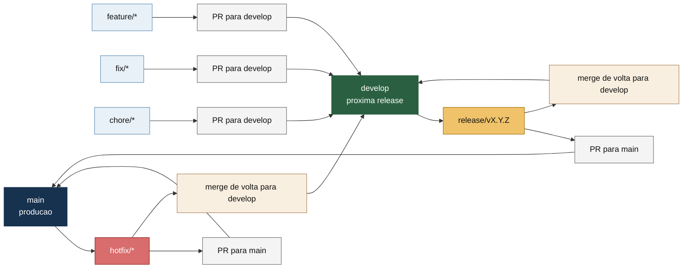
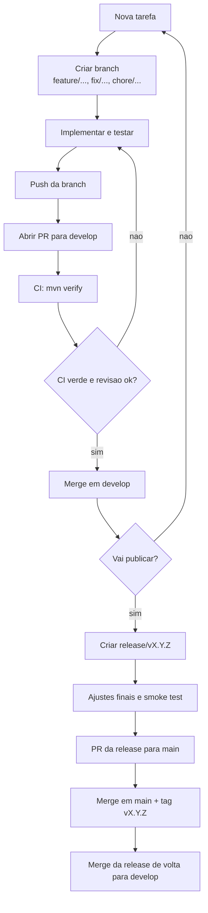

# Git Workflow Visual

Para o passo a passo completo com comandos, veja [gitflow-guide.md](gitflow-guide.md).

## Branch Map



## Day To Day Flow



## Quick Rules

- `main` guarda apenas codigo pronto para producao.
- `develop` junta o que vai entrar na proxima entrega.
- `feature/*`, `fix/*` e `chore/*` sempre nascem de `develop`.
- `release/*` nasce de `develop` quando voce vai publicar.
- `hotfix/*` nasce de `main` quando precisa corrigir producao com urgencia.

## Practical Examples

### New Feature

```text
develop
  -> feature/oauth2-login
  -> PR para develop
  -> merge em develop
```

### Scheduled Release

```text
develop
  -> release/v1.3.0
  -> PR para main
  -> merge em main
  -> tag v1.3.0
  -> merge da release para develop
```

### Urgent Production Fix

```text
main
  -> hotfix/login-rate-limit
  -> PR para main
  -> merge em main
  -> tag v1.3.1
  -> merge do hotfix para develop
```

## One-Line Summary

Pense assim:

- trabalho normal entra em `develop`
- publicacao sai de `develop` para `main`
- incidente de producao sai de `main` e volta para `develop`
